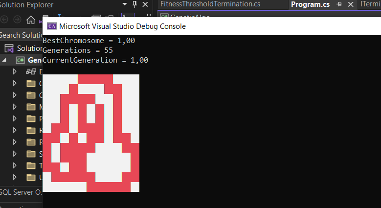

# Genetic Algorithm for Japanese Crossword
This is just a console application for solving Japanese crossword.

# Preview


## How to use it?

### 1. Add your details to a text file like the one below:
 
```txt
11 12
4
2 2
4 2 1
2 5
1 4 4
1 1 3 2
1 4 1
2 1
6 1
2 2
4
4
1 2
4 1
1 1 1 1
1 1 1 1
2 3 1
2 1 2 2
1 4 2
1 3 1
2 2 1
5 2
5
```

First row: axb , where 'a' is the number of rows and 'b' is the number of columns.
Other rows: your value for 'a' nad 'b'

### 2. Update value in your project

```cs
var selection = new Selection();
var crosover = new Crossover(0.75);
var mutate = new Mutation(data, 0.45);
var population = new MyPopulation(600, 600, data);
var ga = new GeneticAlgorithm(population, selection, crosover, mutate);
ga.Termination = new GenerationNumberTermination(300);
ga.Start();
```
